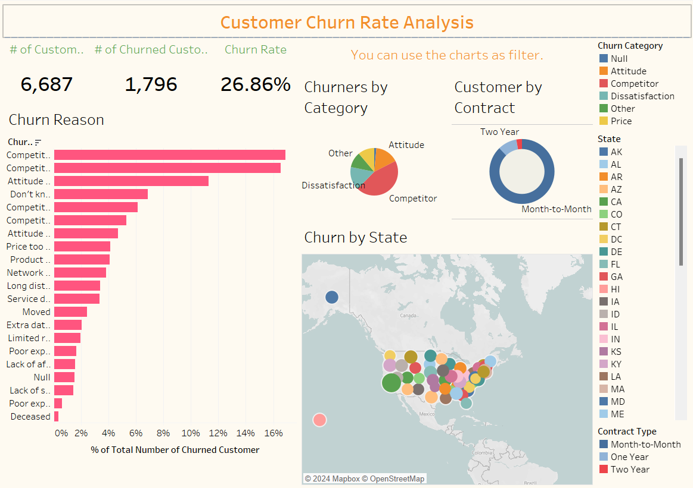

# Customer Churn Rate Analysis - Tableau Dashboard
This project focuses on analyzing customer churn rates using Tableau visualizations. By examining factors such as reasons for churn, category distribution, contract types, and geographical patterns, the dashboard aims to provide insights into customer retention strategies and business performance.

## Dashboard Preview


## Key Observations
- **No of churn vs reason for churn:** This visualization provides insights into the reasons behind customer churn, helping identify areas for improvement or intervention.
- **Pie chart of churn with respect to Category:** This chart illustrates the distribution of churn across different categories, aiding in understanding which categories are most affected.
- **Customers by types of contract - Donut chart:** The donut chart showcases the distribution of customers based on their types of contracts, offering insights into contract preferences.
- **Churn by State - Map chart:** The map chart visualizes churn rates across different states, enabling geographical analysis of churn patterns.

## Usage
- Clone this repository to your local machine 
```bash
  git clone https://github.com/jashpaleja/Customer-Churn-Rate-Analysis-Tableau.git
```
1. **Data.csv:** This dataset contains the necessary information for the Customer Churn Rate Analysis. It includes details such as customer churn status, reasons for churn, category, contract types, states, etc.
2. **Customer Churn Tableau Workbook:** Import this workbook into your Tableau Desktop to explore the dashboard and its underlying visualizations.
3. **Interactivity:** The dashboard allows users to interact with the visualizations dynamically. Users can filter data based on different factors such as reasons for churn, category, contract types, and states to analyze their impact on churn rates.
4. **Measures:** The dashboard provides key measures such as the total number of customers, the number of churned customers, and the churn rate, offering a comprehensive view of churn dynamics.

## Conclusion
The Customer Churn Rate Analysis dashboard serves as a valuable tool for understanding and addressing customer churn within the business. By visually analyzing churn patterns and key factors influencing churn rates, stakeholders can make informed decisions to improve customer retention strategies and enhance overall business performance.
